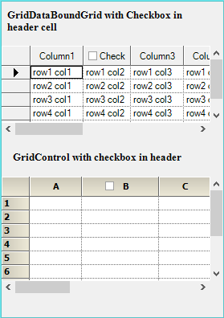

# How to Add a CheckBox to the Header Cell in the WinForms GridDataBoundGrid?

This example illustrates how to add a checkbox to the header cells in the [WinForms GridDataBoundGrid](https://help.syncfusion.com/windowsforms/classic/databoundgrid/overview).

To put a **CheckBox** in the **GridDataBoundGrid**, two events have to be used. The `QueryCellInfo` event is used to set the `style` properties and the `SaveCellInfo` event is used to save the cell's value. The value of the **CheckBox** cannot be stored in the **GridDataBoundGrid**, so any datatype/collection can be used to store the value. The `CheckBoxClick` event gets triggered when the **CheckBox** is clicked. In the following code example, the **CheckBox** is added to the Column header on the **GridDataBoundGrid**.

#### C#

``` csharp
private bool CheckBoxValue = false;   
private void Model_QueryCellInfo(object sender, GridQueryCellInfoEventArgs e)
{
   if(e.ColIndex > 0 && e.RowIndex == 0)
   {
      int colIndex1 = this.gridDataBoundGrid1.Binder.NameToColIndex("Column2");
      if(colIndex1 == e.ColIndex)
      {
         e.Style.Description = "Check";
         e.Style.CellValue = CheckBoxValue;
         e.Style.CellValueType = typeof(bool);
         e.Style.CheckBoxOptions = new GridCheckBoxCellInfo(true.ToString(), false.ToString(), "", true);
         e.Style.CellType = "CheckBox";
         e.Style.CellAppearance = GridCellAppearance.Raised;
         e.Style.Enabled = true;
      }
   }
}

private void Model_SaveCellInfo(object sender, GridSaveCellInfoEventArgs e)
{
   if(e.ColIndex > 0 && e.RowIndex == 0)
   {
      int colIndex1 = this.gridDataBoundGrid1.Binder.NameToColIndex("Column2");
      if(colIndex1 == e.ColIndex)
      {
         if(e.Style.CellValue != null)
  CheckBoxValue = (bool)e.Style.CellValue;
      }
   }
}
```

#### VB

``` vb
Private CheckBoxValue As Boolean = False
Private Sub Model_QueryCellInfo(ByVal sender As Object, ByVal e As GridQueryCellInfoEventArgs)
  If e.ColIndex > 0 AndAlso e.RowIndex = 0 Then
    Dim colIndex1 As Integer = Me.gridDataBoundGrid1.Binder.NameToColIndex("Column2")
    If colIndex1 = e.ColIndex Then
      e.Style.Description = "Check"
      e.Style.CellValue = CheckBoxValue
      e.Style.CellValueType = GetType(Boolean)
      e.Style.CheckBoxOptions = New GridCheckBoxCellInfo(True.ToString(), False.ToString(), "", True)
      e.Style.CellType = "CheckBox"
      e.Style.CellAppearance = GridCellAppearance.Raised
      e.Style.Enabled = True
    End If
  End If
End Sub

Private Sub Model_SaveCellInfo(ByVal sender As Object, ByVal e As GridSaveCellInfoEventArgs)
  If e.ColIndex > 0 AndAlso e.RowIndex = 0 Then
    Dim colIndex1 As Integer = Me.gridDataBoundGrid1.Binder.NameToColIndex("Column2")
    If colIndex1 = e.ColIndex Then
      If e.Style.CellValue IsNot Nothing Then
        CheckBoxValue = CBool(e.Style.CellValue)
      End If
    End If
  End If
End Sub
```

In the following screenshot, the **CheckBox** is added to the Column header on the **GridControl** and **GridDataBoundGrid**.

